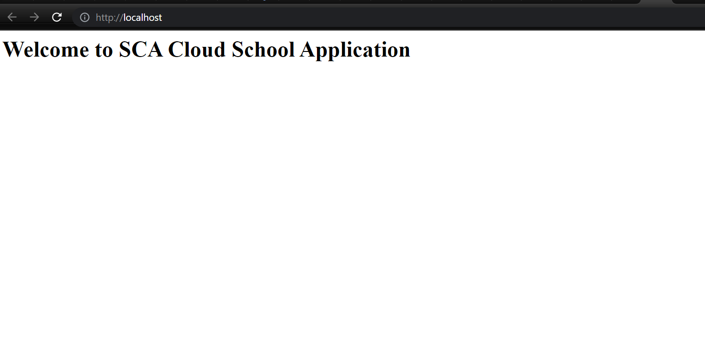

# SCA Cloud School Application

This repository contains the files i used to create a webpage and the docker file to build a docker image.

## Building the Docker Image

- Create the html file and docker file in the docker folder
- Open the terminal and switch to the folder
- `docker build --tag sca .`
- `docker run --name sca -d -p 80:80 sca`
  

## Committing to Start and Feature Branch
- Initialise git repo using 
  
  `git init `
- Switch to start branch
  
  `git checkout -b start`
- Add docker folder 
  
  `git add .`
- Commit files to start branch 
  
  `git commit -m "SCA first commit"`
- Push to github repository
  
   `git remote add origin https://github.com/MsOluwademilade/SCA-Cloud-School-Application.git`
- Switch to feature branch 
  
  `git checkout -b feature`
- Update webpage 
- Build and run docker image
- Push final docker image to docker hub
  
  `docker tag sca oluwademilade/sca_cloud_application`

  `docker push oluwademilade/sca_cloud_application:tagname`

  Link to dockerhub repository [dockerhub](https://hub.docker.com/repository/docker/oluwademilade/sca_cloud_application)